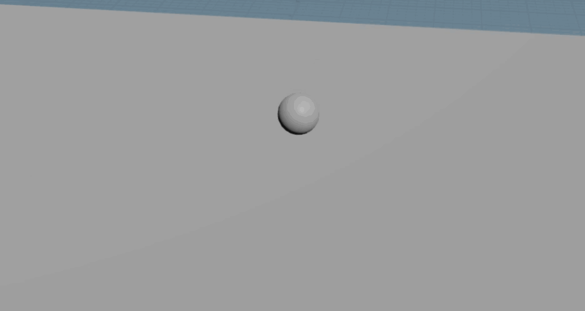
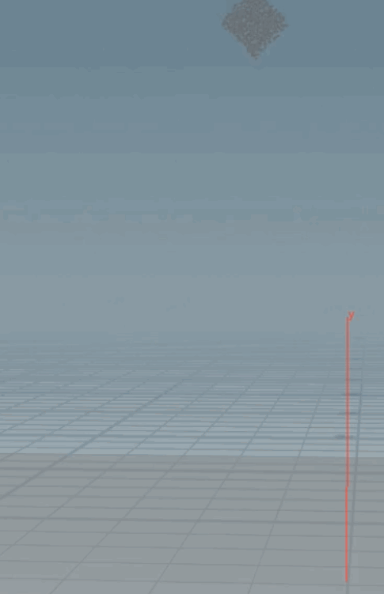
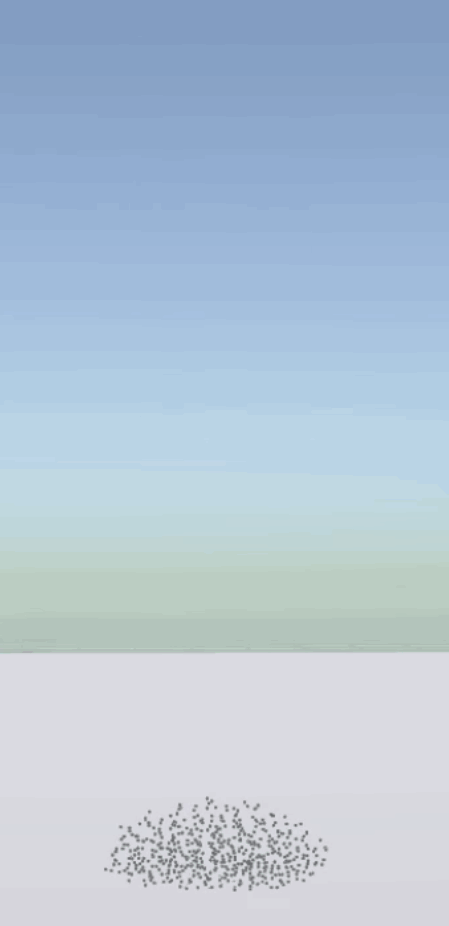

# Yuki - 3D Elastoplastic Simulator (MPM)
## Alexander Chan, Jacob Snipes, Emily Vo
## Overview
This is a CPU implementation of the paper, [A material point method for snow simulation](https://www.math.ucla.edu/~jteran/papers/SSCTS13.pdf). This project was advised by Professor Chenfanfu Jiang of the University of Pennsylvania and Joshuah Wolper, a Ph. D. student at the University of Pennsylvania. 

The material point method is a hybrid lagrangian and eulerian method. Particles simulate a continuum body, and a grid covering the simulation space helps to compute the momentum of the particles. For each frame, the particles' material point quantities are extrapolated to the grid cell nodes. Those quantities are reweighted according to distance from the particle to the cell nodes. The equations of motion are solved on the grid, and then these terms are transferred back from the grid to the particles. Finally, the particles are advected with their new velocities. The grid is reset every frame.

This method is advantageous because it does not require remeshing steps, so it is great for large material deformations. The grid makes the computation of gradients trivial. Furthermore, the grid helps with material-material, material-rigid body collisions. 

* __Implemented on__: Windows 10, i7-7700HQ @ 2.8GHz 16GB, GTX 1060 6GB (Personal Laptop Computer)
* __Tested and simulated on__: Windows 10, i7-5820K @ 3.7GHz 16GB, GTX 1080 8GB (Personal Desktop Computer)

## Demos
### Snow bunny with sphere rigid body

| Purely elastic cube |Snowball with wall boundaries|
|:-------------:|:-------------:|
|||

## Implementation Details

### `globals.h`
This file is included in all other files; it stores the simulation's parameters to make for easy tuning. Further, we include custom definitions and the external Eigen and PartIO libraries.
### `particle.h`
The `Particle` class contains a position vector, velocity vector, mass quantity, volume quantity, *B* matrix as specified by the Affine Particle-In-Cell (APIC) method, elastic deformation gradient matrix (*FE*), and plastic deformation gradient matrix (*FP*).

The total deformation gradient, *F*, can then easily be computed as *F* = *FE* *FP*.

### `sampler.h`
Uses Fast Poisson Disk Sampling to generate samples within a cube. The cube has toroidal boundary conditions that allow the cube to be tiled without violating the poisson disk radius constraint.

Additionally implements mesh sampling using a KD Tree (see `bounds` and `KDTree` classes) by tiling the sampled cube throughout the mesh's bounding volume and subsequently removing sampled points that lie outside the mesh. 

A KDTree was used to test the number of intersections between a ray going from a point to infinity. If the ray intersected the mesh an odd number of times, then it was on the inside of the mesh. Otherwise, we rejected the sample.

Mesh loading was done using tinyobj.

### `gridData.h`
Template class that stores any type of data at the nodes of the marker-and-cell (MAC) grid.

### `macGrid.h`
Stores particles (of class `particles`) as well as node forces, velocities, masses, and momenta (of class `gridData`) in a 3D MAC grid and handles the main MPM algorithm:

- Transfer particle quantities to the MAC grid 
- Compute velocities of the grid nodes
- Compute grid forces (including collision handling)
- Update grid velocities using computed forces
- Update each particle's deformation gradient
- Update each particle's B matrix quantity for [Affine Particle In Cell Method](https://www.math.ucla.edu/~jteran/papers/JSSTS15.pdf). This removes dissipation of velocity information often seen in other particle-in-cell methods and allows for exact conservation of angular momentum between the particle and grid transfers.
- Transfer updated grid quantities back to particles
- Advect particles appropriately
- Write data to BGEO file

The elastic deformation gradient, *FE* is initialized to the identity and is evolved ecery timestep the same way the overall deformation gradient is. However, afterwards, the deformation gradient undergoes singular value decomposition. The singular values are clamped to the parameters of snow. Then the values are multiplied back to become the new elastic deformation gradient.

The plastic deformation gradient, *FP*, was computed using the first Piola-Kirchoff stress tensor (*P*) that can be derived from the plastic energy density function, *Ψ*, given in Stomakhin et. al. (2013) to simulate snow-like behavior. The relationship is such that *P* = ∂*Ψ*/∂*F* where *F* is the total deformation gradient.

*FP* is calculated using a modified singular-value decomposition. This modification clamps the singular values and uses Lamé parameters *µ* and *λ* to modify *P*, adding hardening effects characteristic of snow, allowing it to compact when put in compression and fracture when put in tension. The Lamé parameters are computed based on det(*FP*) and a hardening parameter, *ξ*.

### `simulation.cpp`
Steps through the main algorithm and predicts time to finish writing the desired number of frames.

### `main.cpp`
Reads in OBJ files, computes total mesh volume, sets initial transformation, evenly distributes mass and volume to all particles, and runs the simulation.

## Difficulties
- Behaving like a rigid body
  - Caused by updating grid velocity with `m * g * dt` (a momentum quantity) instead of `g * dt` (a velocity quantity)
  - Prevented the body from deforming upon collision
- Tileable poisson sampled cube
  - First attempted to use lloyd's relaxation algorithm where samples are iteratively moved towards the centroid of a voronoi cell containing that sample. This was following the algorithm presented in the paper [Template Poisson Disk Tiles](http://graphics.cs.kuleuven.be/publications/LD05TPDT/LD05TPDT_paper.pdf). 
  - Voro++ was used to compute the edges and vertices of each voronoi cell. Then, this surface was triangulated in our code. After triangulation, we used the formula for computing the centroid of a triangulated mesh. However, the relaxation drew the samples in away from the boundaries of the cube to make sure the samples were far away enough. When tiled, the artifacts are noticeable, so we decided to use the uniform grid to wrap the samples around the cube and test if the samples on the other side of the cube are far enough. This created more seamless tiling results.
  
## Contributions
- Alexander Chan
  - MAC Grid
  - Grid Data class 
  - Neohookean and Fixed Corotated Elasticity
  - KDTree mesh sampling
  - Simulation class
  - Collision detection for wall boundaries
  
- Jacob Snipes
  - Fast Poisson Disk algorithm 
  - Poisson sample distribution throughout bounding volume
  - Neohookean and Fixed Corotated elasticity
  - Plastic and elastic deformation gradient evolution
  - Plasticity computation 
  - Collision velocity correction for rigid bodies
  
- Emily Vo
  - Particle-Grid transfers 
  - Force calculations
  - Affine Particle In Cell implementation
  - MAC Grid
  - Fast Poisson Disk algorithm and uniform grid data structure
  - Poisson sample distribution throughout bounding volume
  - Bounding volume computation
  - Lloyd's relaxation algorithm
  - Signed distance functions for rigid bodies and normal calculations

## Future Work
- GPU parallelization using CUDA
- Scene setup and rendered simulations

## Sources
- [MPM Course Notes (Jiang et. al., 2016)](https://www.seas.upenn.edu/~cffjiang/research/mpmcourse/mpmcourse.pdf)

- ["A material point method for snow simulation" (Stomakhin et. al., 2013)](https://www.math.ucla.edu/~jteran/papers/SSCTS13.pdf)

- ["Fast Poisson Disk Sampling in Arbitrary Dimensions" (Bridson, 2007)](https://www.cct.lsu.edu/~fharhad/ganbatte/siggraph2007/CD2/content/sketches/0250.pdf)

- ["Template Poisson Disk Tiles", Lagae et. al., 2005](http://graphics.cs.kuleuven.be/publications/LD05TPDT/LD05TPDT_paper.pdf)

## Libraries
- [Eigen](http://eigen.tuxfamily.org/index.php?title=Main_Page)
- [Voro++](http://math.lbl.gov/voro++/)
- [Partio](https://www.disneyanimation.com/technology/partio.html)
